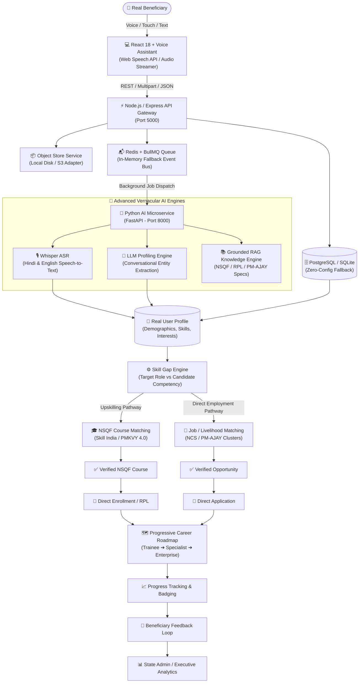

# JeevanVani (जीवनवाणी) - System Architecture & Technical Specification

## 🏛️ High-Level System Architecture

The following diagram illustrates the end-to-end data processing and decision pipeline of **JeevanVani**, designed for Scheduled Caste (SC) beneficiaries under the Grant-in-Aid (GIA) component of PM-AJAY (Ministry of Social Justice & Empowerment, Govt. of India).

```
                    REAL USER
                       │
                       ▼
                 React + Voice
                       │
                       ▼
                Node / Express
                       │
       ┌───────────────┼────────────────┐
       ▼               ▼                ▼
   PostgreSQL        Redis          Object Store
       │               │
       │             BullMQ
       │               │
       │               ▼
       │          Python AI
       │               │
       │       ┌───────┼────────┐
       │       ▼       ▼        ▼
       │     Whisper   LLM     RAG
       │                        │
       │                  NSQF/RPL/
       │                  PM-AJAY/
       │                  Knowledge
       │
       ▼
 REAL USER PROFILE
       │
       ▼
 SKILL GAP ENGINE
       │
       ├───────────────┐
       ▼               ▼
 NSQF COURSE       JOB/LIVELIHOOD
 MATCHING             MATCHING
       │               │
       ▼               ▼
 VERIFIED          VERIFIED
 COURSE            OPPORTUNITY
       │               │
       ▼               ▼
 ENROLLMENT        APPLICATION
       │               │
       └───────┬───────┘
               ▼
        CAREER ROADMAP
               │
               ▼
        PROGRESS TRACKING
               │
               ▼
         FEEDBACK LOOP
               │
               ▼
       ADMIN / ANALYTICS
```

---

## 🔄 Interactive Mermaid Data Flow



---

## 🧩 Architectural Component Breakdown

### 1. Presentation Tier (`React + Voice`)
- **Web Speech API**: Dual-engine speech recognition and real-time synthesis in Hindi (`hi-IN`) and English (`en-IN`).
- **Raw Audio Recorder**: `MediaRecorder` captures real audio chunks and pushes them to the backend Object Store for server-side Whisper transcription.
- **Audio Waveform Visualizer**: Real-time volume frequency analysis via HTML5 `AudioContext` and `AnalyserNode`.
- **Bilingual Interface**: Seamless Hindi/English localization across all cards, dialogs, and career ladders.

### 2. API Gateway (`Node / Express`)
- **Port**: `5000` (Serving `/api` and versioned `/api/v1` routes).
- **Core Controllers**:
  - `authController.js`: JWT authentication, role guards (beneficiary / state admin).
  - `assessmentController.js`: Guided 11-step assessment, progressive profile building, voice transcriptions.
  - `courseController.js`: NSQF course discovery and enrollment.
  - `jobController.js`: Verified NCS/PM-AJAY job matching and application.
  - `roadmapController.js`: Dynamic 4-stage career ladder generation.
  - `feedbackController.js`: 5-star rating and qualitative feedback.
  - `adminController.js`: Macro KPIs, sector distributions, human review queue.

### 3. Storage Tier (`PostgreSQL`, `Redis`, `Object Store`)
- **PostgreSQL / SQLite**:
  - Primary relation engine: `users`, `beneficiary_profiles`, `skills`, `job_roles`, `jobs`, `courses`, `course_enrollments`, `job_applications`, `knowledge_docs`, `human_reviews`.
  - Zero-configuration automatic fallback to embedded SQLite (`better-sqlite3`) if PostgreSQL is not provisioned.
- **Redis & BullMQ**:
  - Distributed queue processing heavy AI workloads without blocking HTTP request threads.
  - Dedicated queues: `voice-transcription`, `profile-extraction`, `rag-query`, `skill-gap-analysis`.
  - In-memory event-driven fallback worker if Redis is offline.
- **Object Store Service**:
  - Abstraction layer supporting local directory hierarchy (`uploads/object_store/audio`, `uploads/object_store/documents`) and S3-compatible cloud object storage.

### 4. AI Subsystem (`Python AI`, `Whisper`, `LLM`, `RAG`)
- **Port**: `8000` (FastAPI / Uvicorn).
- **Whisper ASR**:
  - Dedicated Hindi/English acoustic modeling for rural dialects.
  - Extracts spoken words and passes them to conversational extraction.
- **LLM Entity Extraction**:
  - Extracts age, education, prior employment, practical skills, interests, and mobility preferences from natural conversational transcripts.
- **RAG Knowledge Base**:
  - Grounded corpus indexing official PM-AJAY GIA scheme guidelines, NCVET NSQF Qualification Packs, RPL certification rules, and NSFDC loan policies.
  - Enforces **Anti-Hallucination Labeling** (`VERIFIED` vs `INFERRED`).

### 5. Recommendation & Opportunity Tier
- **Skill Gap Engine**:
  - Determines exact delta between candidate skills and NSQF role benchmarks.
  - Identifies **RPL Eligibility** (prior informal workers qualify for accelerated certification).
  - Computes estimated upskilling duration (in weeks).
- **Verified Course Matching**:
  - Matches candidates to verified Skill India / PMKVY 4.0 courses with 100% PM-AJAY GIA tuition waiver.
- **Verified Job Matching**:
  - 6-factor deterministic scoring:
    $$\text{Match Score} = (0.25 \times \text{Skill}) + (0.20 \times \text{Edu}) + (0.20 \times \text{Loc}) + (0.15 \times \text{Int}) + (0.10 \times \text{Exp}) + (0.10 \times \text{Feas})$$

### 6. Career Progression & Analytics
- **Career Roadmap (`/career-path` & `/roadmap`)**:
  - Visual 4-tier milestone ladder: Trainee $\rightarrow$ Certified Technician $\rightarrow$ Senior Specialist $\rightarrow$ Self-Employed Enterprise Owner.
  - Integrates PM-AJAY ₹50,000 tool-kit subsidy and NSFDC concessional loan linkages (4-6% interest).
- **Progress Tracking**: Tracks enrollment progress, certification status, and job applications.
- **Feedback Loop**: Continuous user ratings feeding algorithmic confidence calibration.
- **State Admin Dashboard (`/admin`)**:
  - High-level KPIs: Total beneficiaries, verification rate, GIA funds disbursed, sector distributions.
  - Human review queue for low-confidence recommendations ($< 70\%$).

---

## 🚀 Running the Full Stack

### 1. Python AI Microservice (Port 8000)
```bash
cd python-ai
python -m pip install -r requirements.txt
python -m uvicorn main:app --host 127.0.0.1 --port 8000
```

### 2. Node.js Backend Gateway (Port 5000)
```bash
cd backend
npm install
npm run dev
```

### 3. React Frontend (Port 5173)
```bash
cd frontend
npm install
npm run dev
```

### 4. Running the Architecture Pipeline Verification Test
```bash
cd backend
node src/utils/testArchitecturePipeline.js
```
